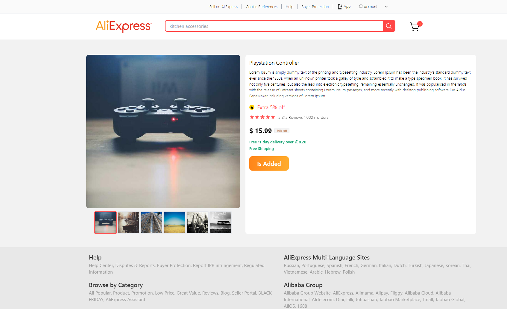

<a name="readme-top"></a>

<div align="center">
  <br/>
  <br/>
  <br/>
  <!-- You are encouraged to replace this logo with your own! Otherwise you can also remove it. -->
  
  <br/>
  <br/>
  <br/>
  <br/>

  <h1><b>Ali Express Clone</b></h1>

  ## 📷 Screenshots

  


</div>

<!-- TABLE OF CONTENTS -->

# 📗 Table of Contents

- [📗 Table of Contents](#-table-of-contents)
- [📖 Ali Express Clone](#-monsters-of-code-2023)
  - [🛠 Built With ](#-built-with-)
    - [Tech Stack ](#tech-stack-)
    - [Key Features ](#key-features-)
  - [🚀 Live Demo ](#-live-demo-)
  - [💻 Getting Started ](#-getting-started-)
    - [Prerequisites](#prerequisites)
    - [Setup](#setup)
    - [Install](#install)
    - [Usage](#usage)
    - [Run tests](#run-tests)
    - [Deployment](#deployment)
  - [👥 Authors ](#-authors-)
  - [🔭 Future Features ](#-future-features-)
  - [Walkthrough ](#walkthrough-)
  - [🤝 Contributing ](#-contributing-)
  - [⭐️ Show your support ](#️-show-your-support-)
  - [🙏 Acknowledgments ](#-acknowledgments-)
  - [📝 License ](#-license-)

<!-- PROJECT DESCRIPTION -->

# 📖 Ali Express Clone<a name="about-project"></a>
Ali Express Clone is a complete e-commerce application that mirrors the functionality of Ali Express. The application has its own backend and database. Users can browse products, search for them in the search bar, register with different authentication methods, log in to purchase products, add them to their cart and complete transactions seamlessly using Stripe.

## 🛠 Built With <a name="built-with"></a>

### Tech Stack <a name="tech-stack"></a>

- Vue
- Nuxt
- Typescript
- Pinia
- Tailwind CSS
- Stripe
- Supabase

<details>
  <summary>Client</summary>
 - Vue <br>
- Nuxt <br>
- Typescript <br>
- Pinia <br>
- Tailwind CSS <br>
- Stripe
</details>

<details>
  <summary>Server</summary>
    - Supabase
</details>

<details>
<summary>Database</summary>
    - Postrgres
</details>

### Key Features <a name="key-features"></a>

- **Responsive Design**

<!-- LIVE DEMO -->

## 🚀 Live Demo <a name="live-demo"></a>

- [Live Demo](https://ali-express-nuxt.vercel.app/)

<!-- - No live demo available yet -->
<p align="right">(<a href="#readme-top">back to top</a>)</p>

<!-- GETTING STARTED -->

## 💻 Getting Started <a name="getting-started"></a>

To get a local copy up and running, follow these steps.

### Prerequisites

- A web browser
- A code editor
- A terminal

### Setup

Clone this repository to your desired folder:

```sh
  git clone https://github.com/SergioPeralta22/AliExpress-Nuxt.git

### Install

Install this project with:

```sh
  cd AliExpress-Nuxt
  npm install
```

### Usage

To run the project, execute the following command:

```sh
  npm run dev
```

### Run tests

To run tests, run the following command:

- no tests available

<!--
Example command:

```sh
  bin/rails test test/models/article_test.rb
```
--->

### Deployment

You can deploy this project using:

```sh
npm run predeploy
npm run deploy

```

<p align="right">(<a href="#readme-top">back to top</a>)</p>

<!-- AUTHORS -->

## 👥 Authors <a name="authors"></a>

👤 Sergio Peralta

- GitHub: [@SergioPeralta22](https://github.com/SergioPeralta22)
- Twitter: [@SePeralta22](https://twitter.com/SePeralta22)
- LinkedIn: [LinkedIn](https://linkedin.com/in/sergioperalta22)

## 🔭 Future Features <a name="future-features"></a>

- **User Profile**
- **User Reviews**
- **User Favorites**

## Walkthrough <a name="walkthrough"></a>


<!-- CONTRIBUTING -->

## 🤝 Contributing <a name="contributing"></a>

Contributions, issues, and feature requests are welcome!

<p align="right">(<a href="#readme-top">back to top</a>)</p>

<!-- SUPPORT -->

## ⭐️ Show your support <a name="support"></a>

If you like this project, give it a ⭐️!

<p align="right">(<a href="#readme-top">back to top</a>)</p>


<p align="right">(<a href="#readme-top">back to top</a>)</p>

<!-- LICENSE -->

## 📝 License <a name="license"></a>

This project is [MIT](./LICENSE) licensed.

<p align="right">(<a href="#readme-top">back to top</a>)</p>
